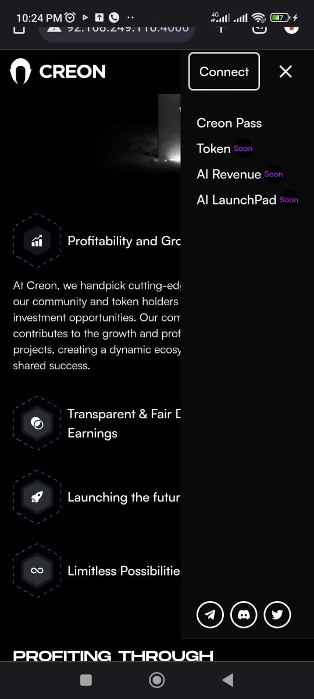

# Niftables FE Tech Test Submission

This is a solution to the Niftables Front-End Development Technical Test

## Table of contents

- [Overview](#overview)
  - [The challenge](#the-challenge)
  - [Screenshot](#screenshot)
  - [Links](#links)
- [My process](#my-process)
  - [Built with](#built-with)
  - [Useful resources](#useful-resources)
- [Author](#author)

## Overview

### The challenge

The task is to perform a pixel-perfect integration of a provided [figma design](https://www.figma.com/file/Y9kCV8ZzERPpl46xNzfvyw/Front-end-Developer-Test?type=design&node-id=23%3A2&mode=design&t=YqAJaMyv6b9UvBIQ-1), showcasing skills in front-end development using NextJS.

### Screenshot


###


### Links

- Live Site URL: ()

## My process

### Built with

- TypeScript
- [Next.js](https://nextjs.org/)
- [Tailwind](https://tailwindcss.com/)
- [ShadcnUI](https://ui.shadcn.com/)

## Getting Started

This is a [Next.js](https://nextjs.org/) project bootstrapped with [`create-next-app`](https://github.com/vercel/next.js/tree/canary/packages/create-next-app).

First, run the development server:

```bash
npm run dev
# or
yarn dev
# or
pnpm dev
# or
bun dev
```

Open [http://localhost:3000](http://localhost:3000) with your browser to see the result.

You can start editing the page by modifying `app/page.tsx`. The page auto-updates as you edit the file.

This project uses [`next/font`](https://nextjs.org/docs/basic-features/font-optimization) to automatically optimize and load Inter, a custom Google Font.


## Author

- Anderson Osayerie - [@andemosa](https://andemosa.vercel.app)
- Twitter - [@andemosa](https://www.twitter.com/andemosa)

